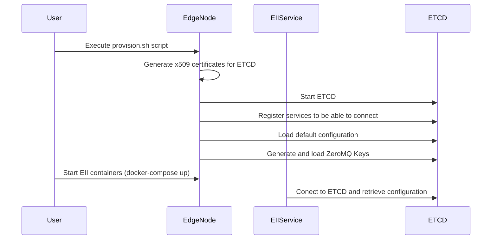
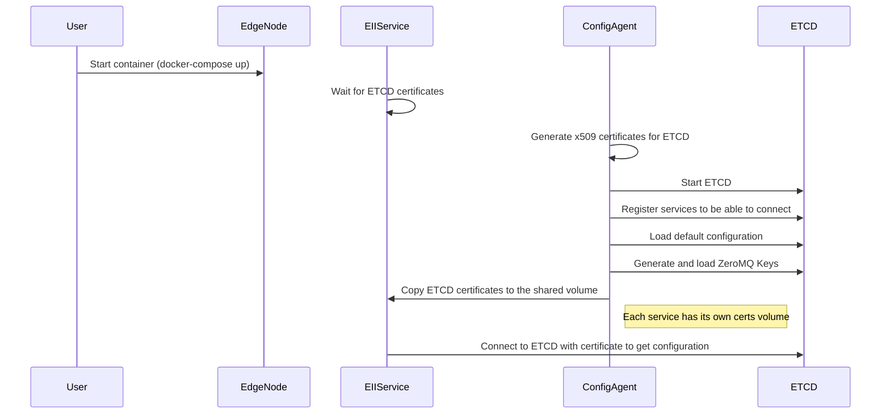

Docker Security Key Injection
=============================

The purpose of this reference implementation is to provide an example of how
the EII provisioning process can be entirely dockerized and can remove any
required user interaction.

The current EII provisioning process requires that users run the `provision.sh`
script to generate the x509 certificates for EII services to connect to the
ETCD configuration backend and generate ZeroMQ keys to enable secure connections
over the EII Message Bus. During this process the default EII configuration is
also loaded into ETCD.

The diagram below shows the high level flow of the current EII provisioning
process.

This solution modifies that flow removing the need for the user to run any
provisioning scripts. It does this by adding a service called the `config-agent`
which generates all of the keys/certificates for the EII services when it is
launched. The `config-agent` injects the security certificates for connecting to
ETCD into the EII services via volume mounts. Once the keys are generated it
loads the default EII configuration into ETCD and in the future will generate
the ZeroMQ keys for EII Message Bus communication.

The diagram below shows a high level flow of the proposed provisioning process.

In this example, the `file-watcher` services represents an EII service. Right
now this service waits for its ETCD certificates to exist in the container. Once
the keys exist, it connects to ETCD using those configuration keys.

## Benefits

* The user will only need a single `docker-compose.yml` file or the Kubernetes
    configuration to get going with EII
* Streamlined user experience for brining up EII containers in production mode
* In the future, we can remove giving every system the rootca, but generate
    root keys for each node which it generates local node keys for
* Simplifies single and multi node setup
* In the future, we could add the ability to "invalidate" all existing tokens
    in the system and it could automatically refresh everything. Or, if tokens
    expire, it could take care of injecting the new token into EII services.

## Next Steps / Improvements

This implementation is not complete, but just a reference. There are several
areas it needs to be extended:

* Currently, the `file-watcher` service has read/write access to ETCD. This
    needs to be changed and the default configuration needs to be added by the
    `config-agent` service.
* Naming of folders/code files is a bit confusing, that needs to be cleaned up
    if this is actually used in EII
* The `certs-dir-provisioner` should be encompassed into the `config-agent`
    service
* `DEV_MODE` needs to be supported
* ZeroMQ keys are not currently generated, but this could be changed
