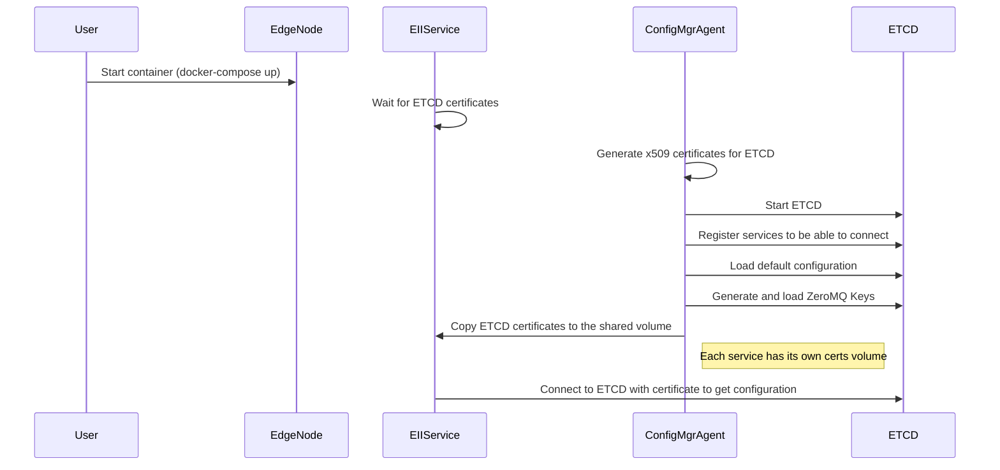

Config Manager Agent
====================


Config Manager Agent is a EII service responsible for below:
- Puts the EII services configs to EII config manager data store
- Additionally in PROD mode, generates
  - Required config manager data store keys/certificates to interact with 
  EII config manager data store like etcd and puts in the volume mounts to be shared with
  other EII services
  - Required messagebus keys for EII services communication
- Creates required provisioning folders with the right permissions needed for other 
  EII services via volume mounts

The diagram below shows a high level flow of `ConfigMgrAgent` service .



>**Note:** 
> Any EII service `waits/restarts` if the config manager data store client key
and certificates are yet to be made available for the container.

 **Optional:** For capturing the data back from Etcd to a JSON file, run the etcd_capture.sh script. This can be achieved using the following command:

```
$ docker exec -it ia_configmgr_agent ./scripts/etcd_capture.sh
```
